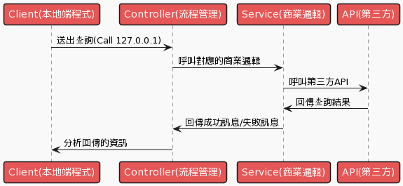

# goMoney

## 流程圖
---

```
@startuml
!theme mars
participant "Client(本地端程式)" as ct
participant "Controller(流程管理)" as cr
participant "Service(商業邏輯)" as se
participant "API(第三方)" as ai

ct->cr: 送出查詢(Call 127.0.0.1)
cr->se: 呼叫對應的商業邏輯
se->ai: 呼叫第三方API

ai->se: 回傳查詢結果
se->cr: 回傳成功訊息/失敗訊息
cr->ct: 分析回傳的資訊
@enduml
```

## 使用說明
---
1. 先將.env.swp檔名改成.env
2. 填寫accessKey與secretKey

## 資料結構
---
bean -> 傳送資料所需的vo物件
controller -> 對應流程圖的流程管理
images -> 說明文件相關圖片存放處
service -> 對應流程圖的商業邏輯
.env.swp -> 請將檔名改成.env
go.mod -> 本程式有用到的相依套件
main.go -> 程式碼主程式
goMoney.exe goMoney執行主程式